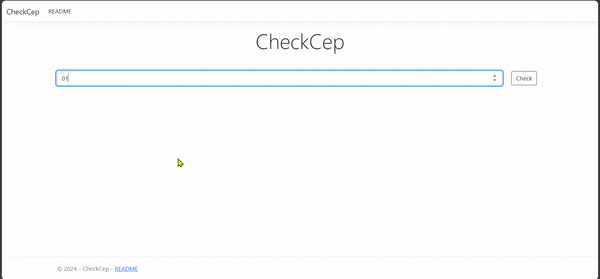

  

  <h5 align="center"> 
    <b>✅ Completo</b> | <b>✅ Responsivo</b>
  </h5>

<h1 align="center">
  
</h1>

### Descrição
O CheckCep é uma aplicação ASP.NET Core MVC que permite aos usuários consultar o endereço completo de um CEP utilizando a API ViaCEP. Além de exibir as informações do endereço, a aplicação possibilita copiar o endereço para a área de transferência ou enviá-lo diretamente para um email fornecido pelo usuário.

### Funcionalidades
- Consulta de endereço pelo CEP (usando a API ViaCEP).
- Exibição das informações detalhadas do endereço, como CEP, rua, cidade, estado, e complemento.
- Envio das informações de endereço para o email do usuário.
- Possibilidade de copiar o endereço para a área de transferência com um botão interativo.

### Tecnologias Utilizadas
- ASP.NET Core MVC
- C#
- API ViaCEP: Serviço público que permite consulta de CEPs e dados de endereço no Brasil.
- Bootstrap 5: Framework para estilização responsiva e componentes como modais e botões.
- JavaScript: Para interatividade na cópia de endereços e controle de modais.
- Newtonsoft.Json: Biblioteca para serialização e desserialização de objetos JSON.

### Estrutura dos Arquivos

#### AddressController.cs
Este controlador gerencia as requisições de busca de endereço e manipulação do CEP. A busca é feita através de uma requisição HTTP para a API ViaCEP, e as informações são desserializadas em um objeto do tipo `Address` e enviadas para a view.

#### EmailController.cs
Este controlador é responsável por capturar o email fornecido pelo usuário e simular o envio do endereço.

#### HomeSite.cshtml
Arquivo da view principal, onde o usuário insere o CEP, visualiza o endereço e interage com os botões para enviar o endereço por email ou copiá-lo.

### Como Usar
1. Na página inicial, insira um CEP válido no campo "CEP" e clique em "Check".
2. Se o CEP for válido, as informações do endereço aparecerão.
3. Você pode copiar o endereço para a área de transferência ou clicar no botão para enviar o endereço para o seu email.

### Exemplo de Resposta
Quando um CEP válido é inserido, o sistema exibe:

- **CEP:** 01001-000
- **Estado:** SP
- **Cidade:** São Paulo
- **Rua:** Praça da Sé
- **Complemento:** Não tem complemento (ou outro valor, se aplicável)

  ---
  

  
  ## 👩🏻‍💻 Autor  
  
  <table>
    <tr>
      <td align="center">
        <a href="https://github.com/robsonlmds">
           
          
            <b>Robson Lucas Messias</b>
          
        </a>
      </td>
    </tr>
  </table>
  
  

   
  <h4 align="center">
    Made by: Robson Lucas Messias | <a href="mailto:robsonlmds@hotmail.com">Contato</a>
  </h4>
  
  

    
  

  
  <h1 align="center">
  
  </h1>
